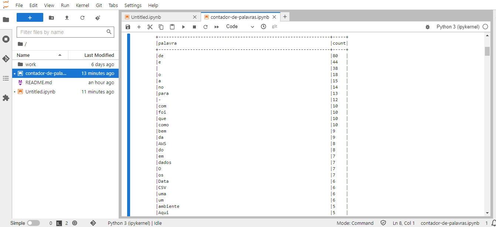

1 - Por falta de potência computacional, optei por iniciar o exercício no docker-playground. Através dos comandos contidos na imagem "configuracao-docker-playground" que está na pasta "prints-processo" desse repositório, fiz a criação e edição do arquivo Dockerfile.

2 - O docker-playground possui uma limitação de recursos no seu nível gratuito, impossibilitando o download dos pacotes necessários para concluir o desafio, já o VS Code estava crashando constantemente ao tentar integrar com o Docker.

3 - Como solução, optei por realizar essa parte através do PowerShell, interagindo de lá com a imagem Docker e gerando um HTTP na porta 8888 para que eu consiguisse abrir o Jupyter pelo meu navegador, sem travar muito e crashar. 

Disponibilizei aqui nessa pasta o arquivo no Jupyter Notebook, o Dockerfile, prints do processo de comandos no PowerShell e também a tabela contendo a contagem de todas as palavras.

