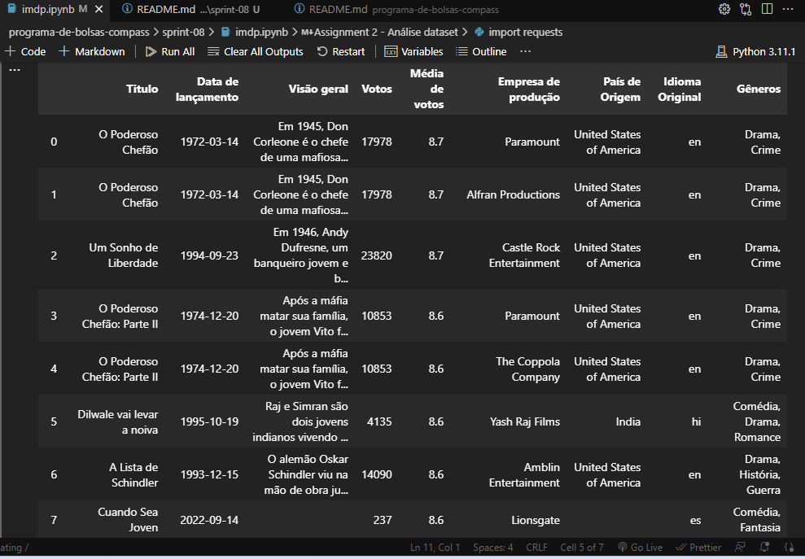
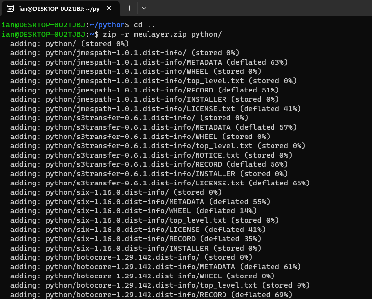
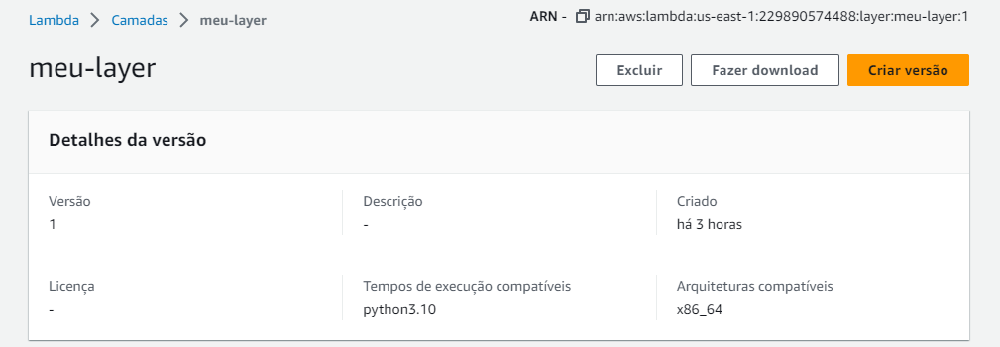
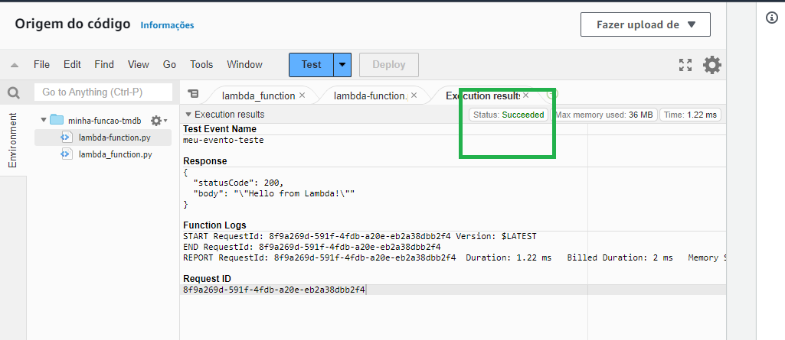

# 1 - Após a requisição das credenciais da API, analisei as colunas para definir melhor algumas perguntas que tragam valor à aqueles dados.

COLUNAS ENCONTRADAS

"id": Índice.
"title": O título do filme.
"original_title": O título do filme em seu idioma original.
"overview": Um breve resumo do filme.
"popularity": Uma medida da popularidade do filme.
"vote_count": O número de votos para o filme.
"vote_average": A classificação média do filme.
"release_date": A data de lançamento do filme.
"adult": Se o filme é ou não para adultos.
"genre_ids": Uma matriz de identificadores para os gêneros do filme.
"original_language": O idioma original do filme.
"poster_path": Caminho para o cartaz do filme.
"backdrop_path": Caminho para o cenário do filme.
"cast": Informações sobre o elenco do filme.
"crew": Informações sobre a equipe do filme.
"keywords": Palavras-chave relacionadas ao filme.
"videos": Vídeos relacionados ao filme.
"reviews": Comentários do filme.
"production_companies": Uma matriz de empresas de produção envolvidas no filme.
"production_countries": Uma matriz de países onde o filme foi produzido.
Cada um desses campos (como "production_companies" ou "cast") tem seu próprio conjunto de subcampos.

TEMA E PERGUNTAS DEFINIDAS

Tema: Produtoras
Perguntas: - Total de filmes de drama/romance de cada produtora 
           - Produtoras com filmes mais populares dentro desses gêneros por década
           - Países das produtoras que possuem filmes de maior popularidade

-----------------------------------------------------------------------------------------------------------

2 - Criação do script python. 

O script escreve o arquivo JSON diretamente pro S3 bucket usando o Boto3 S3 através da função put_object function. Ele escreve os dados do JSON pro buffer StringIO, depois upa o conteúdo do buffer pro S3.

cheque o notebook com as visualizações completas por aqui
__[Jupyter Notebook](https://github.com/ianpt0/programa-de-bolsas-compass/sprint-08/imdp.ipynb/)__  

-----------------------------------------------------------------------------------------------------------

3 - criação do pacote zip pro layer lambda através da WSL pra salvar pacotes como: python, boto3, urllib e pandas 

$ mkdir python
$ cd python
$ pip install boto3 urllib3 -t .
$ pip install pandas
$ cd ..
$ zip -r meulayer.zip python/

você consegue o arquivo do mesmo aqui

__[Jupyter Notebook](https://github.com/ianpt0/programa-de-bolsas-compass/sprint-08/analise-produtoras/meulayer.zip/)__  

após isso criei a camada lambda no console AWS como "meu-layer"

-----------------------------------------------------------------------------------------------------------

4 - criei minha função com o nome de "minha-funcao-tmdb" e defini o layer criado na etapa anterior como o personalizado pra essa função

