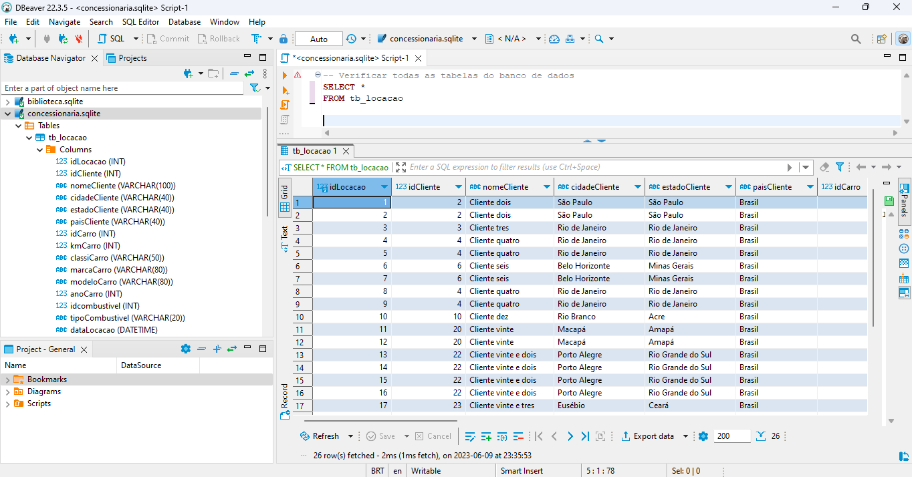
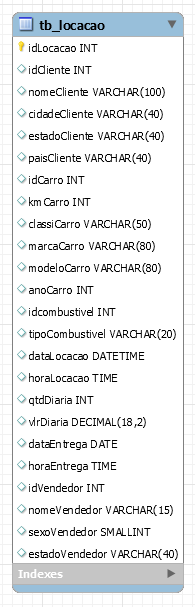
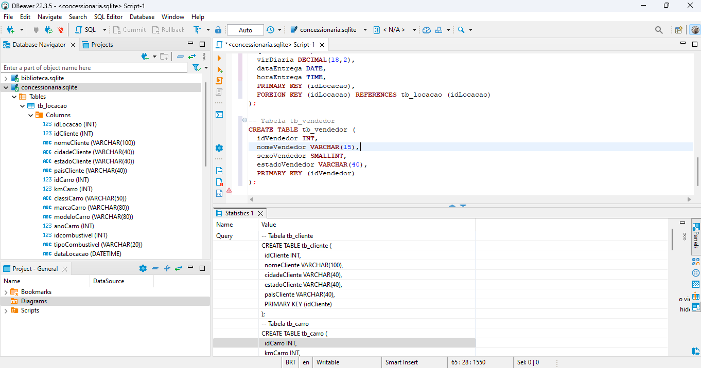

# Normalização de modelagem relacional do arquivo concessionaria.sqlite

Aqui vou descrever o passo-a-passo necessário para normalização de um banco de dados SQLite. No exemplo abaixo usarei o DBeaver como ferramenta principal.

## 1 - Definir o que é necessário para a normalização

Para garantir integridade, consistência e desempenho dos dados, vou utilizar a regra da normalização. Ela tem como objetivo eliminar redundâncias e anomalias nos dados através das formas normais.

As formas normais são um conjunto de regras que definem os requisitos de organização e estruturação dos dados em um banco de dados relacional, promovendo consistência, integridade e eficiência.

As formas normais mais comuns são a Primeira Forma Normal (1NF), a Segunda Forma Normal (2NF) e a Terceira Forma Normal (3NF). E são essas que usarei como parâmetro para normalização desse banco de dados.

Primeira Forma Normal (1NF): Nesta forma normal, os dados são organizados em tabelas, onde cada coluna contém apenas valores atômicos e cada tabela possui uma chave primária única. Não são permitidos valores repetidos ou múltiplos valores em uma única célula.

Segunda Forma Normal (2NF): A 2NF visa eliminar as dependências parciais nos dados. Isso significa que cada coluna em uma tabela deve depender completamente da chave primária da tabela. Se houver colunas que dependem apenas de uma parte da chave primária, elas devem ser movidas para uma tabela separada.

Terceira Forma Normal (3NF): A 3NF busca eliminar as dependências transitivas. Isso significa que as colunas que não fazem parte da chave primária devem depender apenas da chave primária, não de outras colunas não chave. Se houver dependências transitivas, essas colunas devem ser movidas para uma tabela separada.


## 2 - Visualizar nossas colunas e dados
Através da viualização global vou conseguir reconhecer os padrões que fogem das regras formais e vou começar a desenhar a modelagem lógica desse dataset. 





# 2 - Desenho da modelagem lógica

Consegui reconhecer as anomalias e alcançar uma normalização interessante e dentro dos padrões citados anteriormente através da seguinte estrutura:

- Tabela "tb_locacao":
idLocacao (identificador da locação)
iddiente (identificador do cliente)

- Tabela "tb_cliente":
idCliente (identificador do cliente)
nomeCliente (nome do cliente)
cidadeCliente (cidade do cliente)
estadoCliente (estado do cliente)
paisCliente (país do cliente)

- Tabela "tb_carro":
idCarro (identificador do carro)
kmCarro (quilometragem do carro)
classiCarro (classificação do carro)
marcaCarro (marca do carro)
modeloCarro (modelo do carro)
anoCarro (ano do carro)
idCombustivel (identificador do combustível)

- Tabela "tb_combustivel":
idCombustivel (identificador do combustível)
tipoCombustivel (tipo de combustível)

- Tabela "tb_locacao_detalhes":
idLocacao (chave estrangeira referenciando a tabela "tb_locacao")
dataLocacao (data de locação)
horaLocacao (hora de locação)
qtdDiaria (quantidade diária)
virDiaria (valor diário)
dataEntrega (data de entrega)
horaEntrega (hora de entrega)
idVendedor (identificador do vendedor)

- Tabela "tb_vendedor":
idVendedor (identificador do vendedor)
nomeVendedor (nome do vendedor)
sexoVendedor (sexo do vendedor)
estadoVendedor (estado do vendedor)

Agora vou seguir com as Queries pra tornar esse esquema real.

---

# 3 - Criação das tabelas normalizadas

Com o meu banco de dados já conectado no DBeaver, vou criar um novo Script SQL com as instruções da tabela normalizada nos padrões que defini no passo anterior. 

```sql
-- Tabela tb_cliente
CREATE TABLE tb_cliente (
  idCliente INT,
  nomeCliente VARCHAR(100),
  cidadeCliente VARCHAR(40),
  estadoCliente VARCHAR(40),
  paisCliente VARCHAR(40),
  PRIMARY KEY (idCliente)
);

-- Tabela tb_carro
CREATE TABLE tb_carro (
  idCarro INT,
  kmCarro INT,
  classiCarro VARCHAR(50),
  marcaCarro VARCHAR(80),
  modeloCarro VARCHAR(80),
  anoCarro INT,
  idCombustivel INT,
  PRIMARY KEY (idCarro),
  FOREIGN KEY (idCombustivel) REFERENCES tb_combustivel (idCombustivel)
);

-- Tabela tb_combustivel
CREATE TABLE tb_combustivel (
  idCombustivel INT,
  tipoCombustivel VARCHAR(20),
  PRIMARY KEY (idCombustivel)
);

-- Tabela tb_locacao
CREATE TABLE tb_locacao (
  idLocacao INT,
  idCliente INT,
  idCarro INT,
  idVendedor INT,
  dataLocacao DATETIME,
  horaLocacao TIME,
  qtdDiaria INT,
  virDiaria DECIMAL(18,2),
  dataEntrega DATE,
  horaEntrega TIME,
  PRIMARY KEY (idLocacao),
  FOREIGN KEY (idCliente) REFERENCES tb_cliente (idCliente),
  FOREIGN KEY (idCarro) REFERENCES tb_carro (idCarro),
  FOREIGN KEY (idVendedor) REFERENCES tb_vendedor (idVendedor)
);

-- Tabela tb_locacao_detalhes
CREATE TABLE tb_locacao_detalhes (
  idLocacao INT,
  dataLocacao DATETIME,
  horaLocacao TIME,
  qtdDiaria INT,
  virDiaria DECIMAL(18,2),
  dataEntrega DATE,
  horaEntrega TIME,
  PRIMARY KEY (idLocacao),
  FOREIGN KEY (idLocacao) REFERENCES tb_locacao (idLocacao)
);

-- Tabela tb_vendedor
CREATE TABLE tb_vendedor (
  idVendedor INT,
  nomeVendedor VARCHAR(15),
  sexoVendedor SMALLINT,
  estadoVendedor VARCHAR(40),
  PRIMARY KEY (idVendedor)
);
```



---
# 3 - Export do arquivo SQL
Feito! O arquivo SQL pode ser conferido aqui nessa pasta, com o nome de "Script-1.sql"

