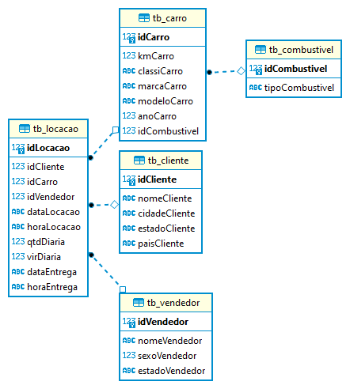

# Normalização de modelagem relacional do arquivo concessionaria.sqlite

Aqui vou descrever o passo-a-passo necessário para normalização de um banco de dados SQLite. No exemplo abaixo usarei o DBeaver como ferramenta principal.

## 1 - Definir o que é necessário para a normalização

Para garantir integridade, consistência e desempenho dos dados, vou utilizar a regra da normalização. Ela tem como objetivo eliminar redundâncias e anomalias nos dados através das formas normais.

As formas normais são um conjunto de regras que definem os requisitos de organização e estruturação dos dados em um banco de dados relacional, promovendo consistência, integridade e eficiência.

As formas normais mais comuns são a Primeira Forma Normal (1NF), a Segunda Forma Normal (2NF) e a Terceira Forma Normal (3NF). E são essas que usarei como parâmetro para normalização desse banco de dados.


## 2 - Visualizar nossas colunas e dados
Através da viualização global vou conseguir reconhecer os padrões que fogem das regras formais e vou começar a desenhar a modelagem lógica desse dataset. 


## 3 - Desenho da modelagem lógica

Consegui reconhecer as anomalias e alcançar uma normalização interessante dentro dos padrões citados anteriormente através da seguinte estrutura:

### Tabela "tb_cliente":
* idCliente (identificador do cliente)
* nomeCliente (nome do cliente)
* cidadeCliente (cidade do cliente)
* estadoCliente (estado do cliente)
* paisCliente (país do cliente)

### Tabela "tb_carro":
* idCarro (identificador do carro)
* kmCarro (quilometragem do carro)
* classiCarro (classificação do carro)
* marcaCarro (marca do carro)
* modeloCarro (modelo do carro)
* anoCarro (ano do carro)
* idCombustivel (identificador do combustível)

### Tabela "tb_combustivel":
* idCombustivel (identificador do combustível)
* tipoCombustivel (tipo de combustível)

### Tabela "tb_locacao":
* idLocacao (chave estrangeira referenciando a tabela "tb_locacao")
* idCliente (identificador do cliente)
* idCarro (identificador do carro)
* idVendedor (identificador do vendedor)
* dataLocacao (data de locação)
* horaLocacao (hora de locação)
* qtdDiaria (quantidade diária)
* virDiaria (valor diário)
* dataEntrega (data de entrega)
* horaEntrega (hora de entrega)

### Tabela "tb_vendedor":
* idVendedor (identificador do vendedor)
* nomeVendedor (nome do vendedor)
* sexoVendedor (sexo do vendedor)
* estadoVendedor (estado do vendedor)

Agora que cada tabela tem uma chave primária definida e não há dependências nas colunas, vou seguir com as Queries pra tornar esse esquema real.


## 4 - Criação de script para normalização das tabelas

Com o meu banco de dados já conectado no DBeaver, vou criar um novo Script SQL com as instruções da tabela normalizada nos padrões que defini no passo anterior. 

```sql
-- Tabela tb_cliente
-- Criando a tabela tb_cliente
CREATE TABLE tb_cliente (
  idCliente INT PRIMARY KEY,
  nomeCliente VARCHAR(100),
  cidadeCliente VARCHAR(40),
  estadoCliente VARCHAR(40),
  paisCliente VARCHAR(40)
);

-- Criando a tabela tb_combustivel
CREATE TABLE tb_combustivel (
  idCombustivel INT PRIMARY KEY,
  tipoCombustivel VARCHAR(20)
);

-- Criando a tabela tb_carro
CREATE TABLE tb_carro (
  idCarro INT PRIMARY KEY,
  kmCarro INT,
  classiCarro VARCHAR(50),
  marcaCarro VARCHAR(80),
  modeloCarro VARCHAR(80),
  anoCarro INT,
  idCombustivel INT,
  FOREIGN KEY (idCombustivel) REFERENCES tb_combustivel(idCombustivel)
);

-- Criando a tabela tb_vendedor
CREATE TABLE tb_vendedor (
  idVendedor INT PRIMARY KEY,
  nomeVendedor VARCHAR(15),
  sexoVendedor SMALLINT,
  estadoVendedor VARCHAR(40)
);

-- Criando a tabela tb_locacao
CREATE TABLE tb_locacao (
  idLocacao INT PRIMARY KEY,
  idCliente INT,
  idCarro INT,
  idVendedor INT,
  dataLocacao DATETIME,
  horaLocacao TIME,
  qtdDiaria INT,
  virDiaria DECIMAL(18, 2),
  dataEntrega DATE,
  horaEntrega TIME,
  FOREIGN KEY (idCliente) REFERENCES tb_cliente(idCliente),
  FOREIGN KEY (idCarro) REFERENCES tb_carro(idCarro),
  FOREIGN KEY (idVendedor) REFERENCES tb_vendedor(idVendedor)
  );
```


## 4 - Export do arquivo SQL e do diagrama
Feito! O arquivo SQL pode ser conferido aqui nessa pasta, com o nome de "Script-1.sql"

O diagrama da nova estruturação que foi feita pode ser conferido abaixo.

