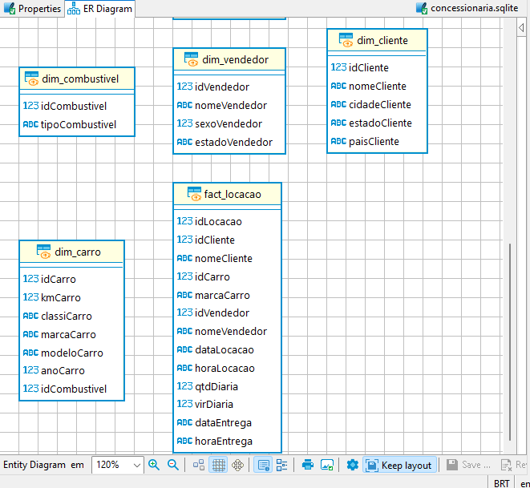

# Modelo Dimensional com base no Modelo Relacional criado anteriormente

Com base no modelo relacional das concessionárias que foi normalizado [aqui](https://github.com/ianpt0/programa-de-bolsas-compass/sprint-09/assigment-1-modelagem-relacional-normalizacao/), podemos criar um modelo dimensional utilizando views para fatos e dimensões.

## 1 - Criação das views:

Com as views criadas, teremos um modelo dimensional com as dimensões "dim_cliente, dim_combustivel, dim_carro, dim_vendedor" e um fato "fact_locacao". As views fornecerão uma visão simplificada e consolidada dos dados, permitindo consultas analíticas e a análise de métricas específicas.

Começaremos criando o script das views para as dimensões:

```sql
-- View para a dimensão Cliente
CREATE VIEW dim_cliente AS
SELECT
    idCliente,
    nomeCliente,
    cidadeCliente,
    estadoCliente,
    paisCliente
FROM
    tb_cliente;

-- View para a dimensão Combustível
CREATE VIEW dim_combustivel AS
SELECT
    idCombustivel,
    tipoCombustivel
FROM
    tb_combustivel;

-- View para a dimensão Carro
CREATE VIEW dim_carro AS
SELECT
    idCarro,
    kmCarro,
    classiCarro,
    marcaCarro,
    modeloCarro,
    anoCarro,
    idCombustivel
FROM
    tb_carro;

-- View para a dimensão Vendedor
CREATE VIEW dim_vendedor AS
SELECT
    idVendedor,
    nomeVendedor,
    sexoVendedor,
    estadoVendedor
FROM
    tb_vendedor;

-- View para o fato Locação
CREATE VIEW fact_locacao AS
SELECT
    l.idLocacao,
    c.idCliente,
    c.nomeCliente,
    d.idCarro,
    d.marcaCarro,
    v.idVendedor,
    v.nomeVendedor,
    l.dataLocacao,
    l.horaLocacao,
    l.qtdDiaria,
    l.virDiaria,
    l.dataEntrega,
    l.horaEntrega
FROM
    tb_locacao l
INNER JOIN
    tb_cliente c ON l.idCliente = c.idCliente
INNER JOIN
    tb_carro d ON l.idCarro = d.idCarro
INNER JOIN
    tb_vendedor v ON l.idVendedor = v.idVendedor;
```


## 2 - Análise das views criadas

Feito! O arquivo SQL gerado pode ser conferido nesta pasta com o nome de "modelo-dimensional.sql".

Agora, seguindo com maior detalhes sobre as views com base no modelo dimensional proposto, temos as seguintes métricas:



### Métricas relacionadas à dimensão Cliente:
* Número total de clientes
* Número de clientes por cidade
* Número de clientes por estado
* Número de clientes por país
* Métricas relacionadas à dimensão Combustível:

### Número total de tipos de combustível
* Número de carros por tipo de combustível
* Métricas relacionadas à dimensão Carro:

### Número total de carros
* Quilometragem média dos carros
* Número de carros por marca
* Número de carros por modelo
* Número de carros por ano
* Métricas relacionadas à dimensão Vendedor:

### Número total de vendedores
* Número de vendedores por sexo
* Número de vendedores por estado
* Métricas relacionadas ao fato Locação:

### Fato com número total de locações
* Número de locações por cliente
* Número de locações por carro
* Número de locações por vendedor
* Valor total das locações
* Valor médio das locações
* Duração média das locações

