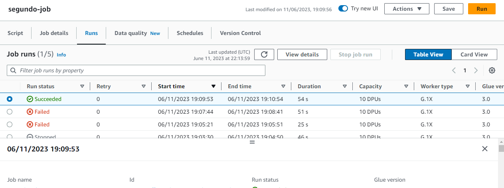
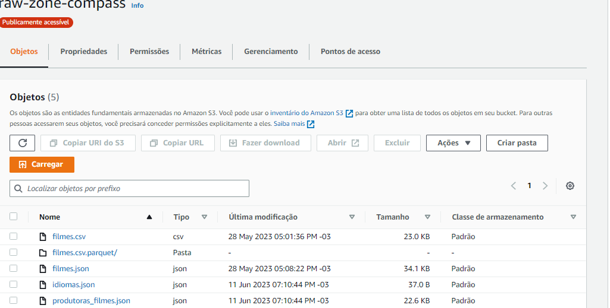

# Processamento da Trusted

Aqui faremos uso do Apache Spark no processo, integrando dados existentes na camada Raw Zone. O objetivo é gerar uma visão padronizada dos dados, persistida no S3,  compreendendo a Trusted Zone do data lake. Nossos jobs Spark serão criados por meio do AWS Glue.

Todos os dados serão persistidos na Trusted no formato PARQUET, particionados por data de criação do tweet  ou data de coleta do TMDB (dt=<ano\mês\dia> exemplo: dt=2018\03\31). A exceção fica para os dados oriundos do processamento batch (CSV), que não precisam ser particionados.

Iremos separar o processamento em dois jobs: o primeiro, para carga histórica, será responsável pelo processamento dos arquivos CSV  e o segundo, para carga de dados do TMDB. Lembre-se que suas origens serão os dados existentes na RAW Zone.


## 1 - Primeiro Job | Processamento do arquivo CSV:

Primeiro vamos dar uma olhada de como está meu Bucket de RAW Zone atualmente.


Faremos a carga histórica do arquivo "filmes.csv" seguindo os seguintes passos:

- Criando um novo job no AWS Glue para processar os arquivos CSV.
- Na configuração do job, definindo o local de origem dos arquivos CSV no meu bucket.
- Especificando o formato dos arquivos CSV como fonte de dados no AWS Glue.
- Configurando a estrutura de colunas dos arquivos CSV no esquema do AWS Glue.
- Definindo a opção de particionamento para não particionar os dados históricos CSV, conforme mencionado na exceção.
- Escolhendo o formato de destino como PARQUET.
- Especificando o local de destino no S3 para armazenar os dados processados no formato PARQUET.
- Executando o job para processar os arquivos CSV e salvar os dados resultantes no formato PARQUET na minha Trusted Zone.


### Script pro Glue feito baseado nos processos citados anteriormente:

```python
import sys
from awsglue.transforms import *
from awsglue.utils import getResolvedOptions
from pyspark.context import SparkContext
from awsglue.context import GlueContext
from awsglue.job import Job


args = getResolvedOptions(sys.argv, ['JOB_NAME'])

source_bucket = "raw-zone-compass"
source_path_csv = "filmes.csv"

sc = SparkContext()
glueContext = GlueContext(sc)
spark = glueContext.spark_session
job = Job(glueContext)
job.init(args['JOB_NAME'], args)

connection_options = {
    "paths": [f"s3://{source_bucket}/{source_path_csv}"],
    "recurse": True
}

data_frame = glueContext.create_dynamic_frame.from_options(
    connection_type="s3",
    connection_options=connection_options,
    format="csv",
    format_options={
        "withHeader": True,
        "separator": ","
    }
)

data_frame_df = data_frame.toDF()
data_frame_df = data_frame_df.withColumnRenamed("Data de lançamento", "Data_de_lancamento")

data_frame_dynamic = glueContext.create_dynamic_frame.from_catalog(
    database = "minha-database",
    table_name = "minha-tabela",
    transformation_ctx = "data_frame_dynamic"
)

glueContext.write_dynamic_frame.from_options(
    frame=data_frame_dynamic,
    connection_type="s3",
    connection_options={
        "path": f"s3://{source_bucket}/{source_path_csv}.parquet"
    },
    format="parquet"
)

job.commit()

```

Feito! Importante observar os logs para localizar possíveis erros e ajustar o script conforme necessário.


Na imagem abaixo visualizamos novamente nosso Bucket mas agora atualizado com nosso arquivo PARQUET.


## 2 - Segundo Job | carga de dados do TMDB:

Criaremos um segundo job com um Script para carregar dados do TMDB usando o AWS Glue:

```python
import boto3
import urllib3
import json
from collections import defaultdict
from pyspark.context import SparkContext
from awsglue.context import GlueContext

api_key = "268b202082529c916c317fd2f539f950"
base_url = "https://api.themoviedb.org/3"
CHUNK_SIZE = 10000
bucket_name = 'raw-zone-compass'

s3 = boto3.client('s3')

def get_movie_details(movie_id, language='pt-BR'):
    movie_details_url = f"{base_url}/movie/{movie_id}?api_key={api_key}&language={language}"
    http = urllib3.PoolManager()
    response = http.request('GET', movie_details_url)
    return json.loads(response.data)

def download_data(glueContext, N):
    produtoras_filmes = defaultdict(list)
    idiomas = defaultdict(int)

    for i in range(1, N+1, CHUNK_SIZE):
        top_movies_url = f"{base_url}/movie/top_rated?api_key={api_key}&language=pt-BR&page={i}"
        http = urllib3.PoolManager()
        response = http.request('GET', top_movies_url)
        data = json.loads(response.data)

        for movie in data['results']:
            movie_details = get_movie_details(movie['id'])

            generos = [genre['name'] for genre in movie_details['genres']]
            if "Romance" in generos or "Drama" in generos:
                for prod_company in movie_details['production_companies']:
                    company_name = prod_company['name']
                    produtoras_filmes[company_name].append({
                        'Titulo': movie['title'],
                        'Data de lançamento': movie['release_date'],
                        'Visão geral': movie['overview'],
                        'Popularidade': movie['popularity'],
                        'Votos': movie['vote_count'],
                        'Média de votos': movie['vote_average'],
                        'País de Origem': ', '.join([country['name'] for country in movie_details['production_countries']]),
                        'Idioma Original': movie_details['original_language'],
                        'Gêneros': ', '.join(generos)
                    })
                idiomas[movie_details['original_language']] += 1

    # Salvando os dados em um bucket do S3
    s3.put_object(Body=json.dumps(produtoras_filmes), Bucket=bucket_name, Key='produtoras_filmes.json')
    s3.put_object(Body=json.dumps(idiomas), Bucket=bucket_name, Key='idiomas.json')

def main():
    # Crie o contexto do Spark e o contexto do Glue
    sc = SparkContext()
    glueContext = GlueContext(sc)

    # Número de páginas de filmes para baixar
    N = 10

    # Baixe os dados e carregue-os no AWS Glue
    download_data(glueContext, N)

if __name__ == "__main__":
    main()
```

Feito! Tivemos sucesso e os dados foram carregados com sucesso para o Bucket


Por fim, na foto abaixo conseguimos observar nosso Bucket atualizado após todos os processos abordados



