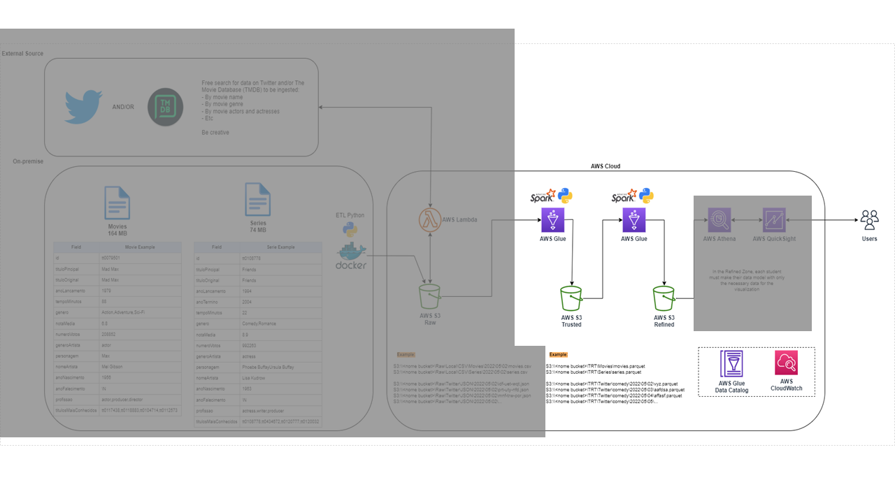
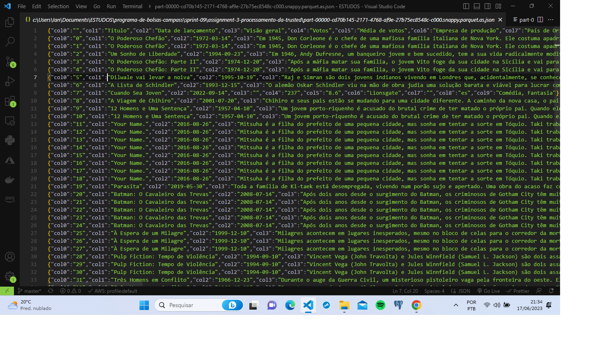
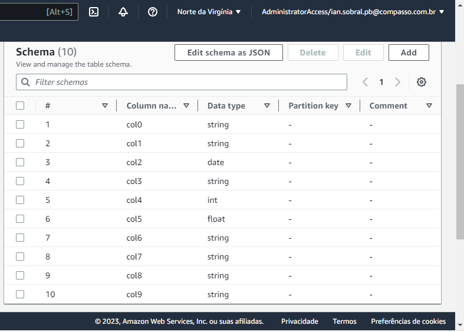
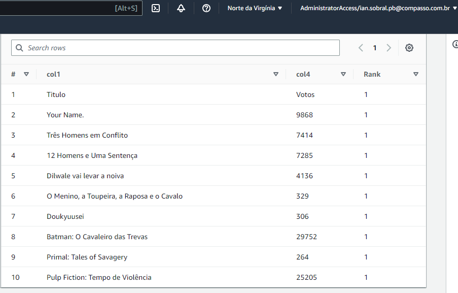
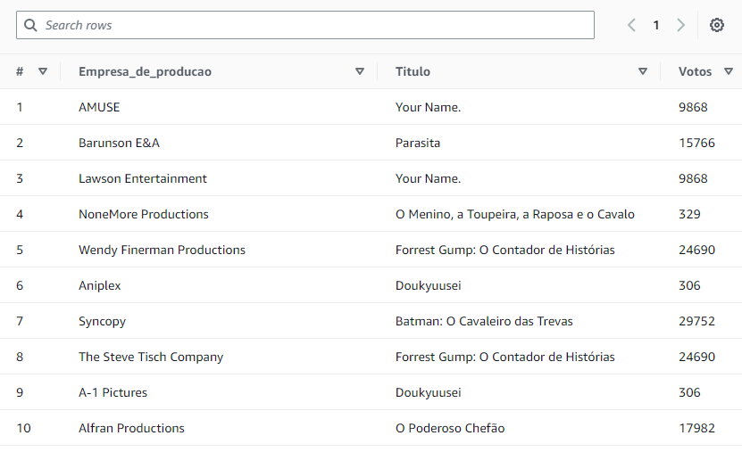
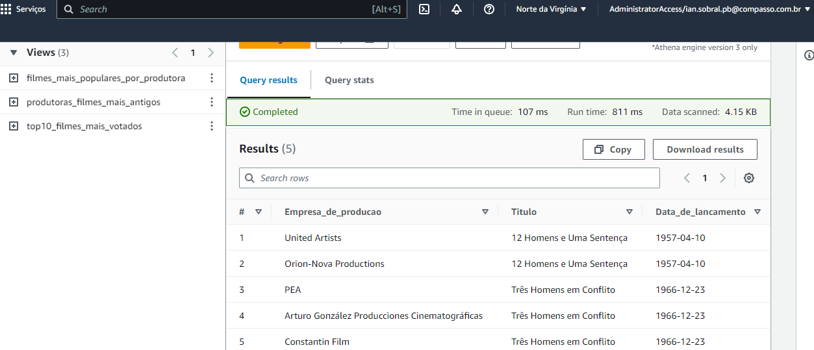
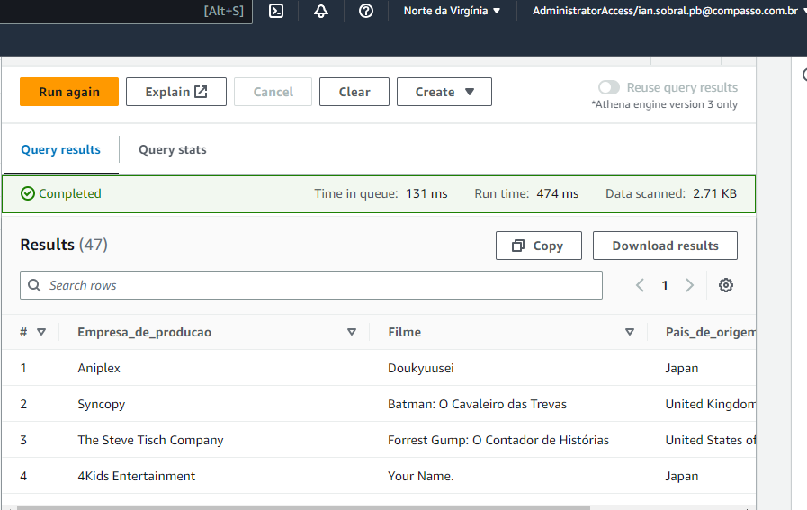

# Modelagem de dados da Refined

A camada Refined corresponde à camada de um data lake em que os dados estão prontos para análise e extração de insights. Sua origem corresponde aos dados da camada anterior, a Trusted.

Devemos pensar em estruturar os dados seguindo os princípios de modelagem multidimensional, a fim de permitir consultas sobre diferentes perspectivas.

Nesta etapa do desafio, devem ser criadas no AWS Glue Data Catalog  as tabelas e, se necessário, views,  de acordo com modelagem de dados solicitada, a fim de disponibilizar os dados para a ferramenta de visualização (QuickSight, a partir da próxima Sprint). Lembre-se que a origem será os dados oriundos da Trusted Zone.



O desafio aqui é presentar a modelagem de dados da camada Refined. Exportando o modelo de dados na forma de imagem e registrando aqui e no repositório do Github.

## 1 - Criando a tabela e definindo colunas:

Vou usar o arquivo parquet que criei no passo anterior no S3 para criar uma tabela no Glue.
Para isso, baixei no VS Code o plugin "Parquet Viewer" para conseguir visualizar todas as tabelas do parquet criado.




OK! Agora é só definir o nome das colunas no esquema do AWS Glue.
Isso pode ser definido manualmente na GUI da AWS mas, por questões de agilidade e assertividade, optei por criar um JSON com essas colunas.


```json
[
    {
        "Name": "col0",
        "Type": "string"
    },
    {
        "Name": "col1",
        "Type": "string"
    },
    {
        "Name": "col2",
        "Type": "string"
    },
    {
        "Name": "col3",
        "Type": "string"
    },
    {
        "Name": "col4",
        "Type": "string"
    },
    {
        "Name": "col5",
        "Type": "string"
    },
    {
        "Name": "col6",
        "Type": "string"
    },
    {
        "Name": "col7",
        "Type": "string"
    },
    {
        "Name": "col8",
        "Type": "string"
    },
    {
        "Name": "col9",
        "Type": "string"
    }
]
```

Após inserir o JSON já tenho as colunas com os seus tipos de dados já definidos. 
Abaixo segue o nome das colunas e o que representam.

"col0":"Index",
"col1":"Titulo",
"col2":"Data de lançamento",
"col3":"Visão geral",
"col4":"Votos",
"col5":"Média de votos",
"col6":"Empresa de produção",
"col7":"País de Origem",
"col8":"Idioma Original",
"col9":"Gêneros"



## 2 - Criando as views no Athena:

Para cria-las corretamente, segui a documentação oficial da AWS.
É possível checar a documentação __[aqui](https://docs.aws.amazon.com/athena/latest/ug/views.html#creating-views/)__ .

Na Sprint 8 (confira o repositório com o artigo do mesmo __[neste link](https://docs.aws.amazon.com/athena/latest/ug/views.html#creating-views/)__) eu defini o tema, perguntas e o script python.

Vou fazer uma view por pergunta definida, seguiremos esse artigo dentro dessa estrutura.
Algumas alterações foram feitas nas perguntas para melhor aproveitamento dos dados e do futuro deashboard.

### View por pergunta definida

**Tema:** Produtoras

**Perguntas:** 

- Top 10 filmes com maior quantidade de votos

Criei a view "Top10_Filmes_Mais_Votados" 



```sql
CREATE VIEW Top10_Filmes_Mais_Votados AS
SELECT *
FROM (
    SELECT
        col1,
        col4,
        ROW_NUMBER() OVER (PARTITION BY col1 ORDER BY col4 DESC) AS Rank
    FROM
        refined
) sub
WHERE Rank = 1
ORDER BY col4 DESC
LIMIT 10;
```

- Filmes mais populares por produtora



```sql
CREATE VIEW Filmes_Mais_Populares_Por_Produtora AS
SELECT
    refined.col6 AS Empresa_de_producao,
    refined.col1 AS Titulo,
    refined.col4 AS Votos
FROM
    refined
JOIN (
    SELECT
        col6 AS Empresa_de_producao,
        MAX(col4) AS Max_Votos
    FROM
        refined
    GROUP BY
        col6
) sub
ON refined.col6 = sub.Empresa_de_producao AND refined.col4 = sub.Max_Votos;
```

- Filmes mais antigos de cada produtora



```sql
SELECT
    refined.col6 AS Empresa_de_producao,
    refined.col1 AS Titulo,
    refined.col2 AS Data_de_lancamento
FROM
    refined
JOIN (
    SELECT
        col6 AS Empresa_de_producao,
        MIN(col2) AS Data_de_lancamento
    FROM
        refined
    GROUP BY
        col6
    ORDER BY
        Data_de_lancamento
    LIMIT 5
) sub
ON refined.col6 = sub.Empresa_de_producao AND refined.col2 = sub.Data_de_lancamento
ORDER BY
    Data_de_lancamento;
```


- Filmes mais populares por país de cada produtora



```sql
SELECT DISTINCT
    refined.col6 AS Empresa_de_producao,
    col1 as Filme,
    refined.col7 AS Pais_de_origem
FROM
    refined
JOIN (
    SELECT
        col6 AS Empresa_de_producao,
        MAX(col5) AS Max_Media_votos
    FROM
        refined
    GROUP BY
        col6
) sub
ON refined.col6 = sub.Empresa_de_producao AND refined.col5 = sub.Max_Media_votos;
```

