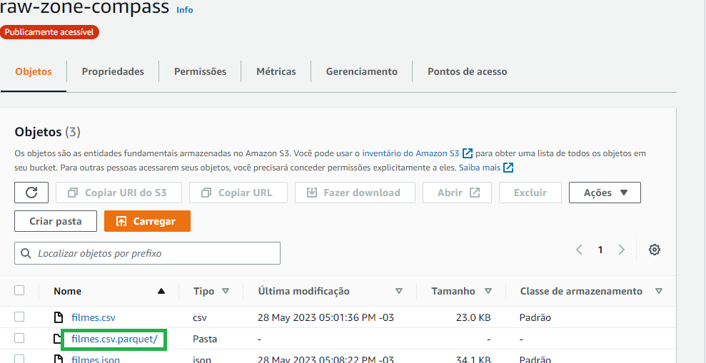

# Processamento de dados da Refined

Na atividade anterior, você definiu seu modelo de dados da camada Trusted. Agora é tempo de processar os dados da camada Trusted, armazena-os na Refined, de acordo com seu modelo.

Aplicaremos novamente o Apache Spark no processo, utilizando jobs cuja origem sejam dados da camada Trusted Zone e e o destino, a camada Refined Zone.  Aqui, novamente, todos os dados serão persistidos no formato PARQUET, particionados, se necessário,  de acordo com as necessidades definidas para a camada de visualização.

