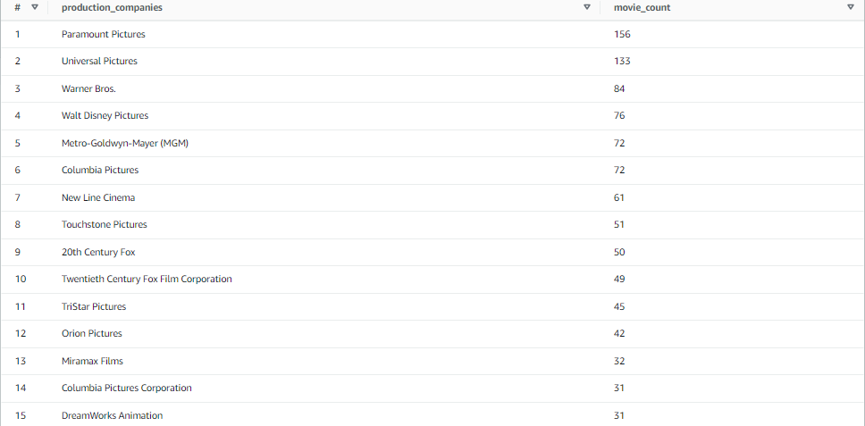
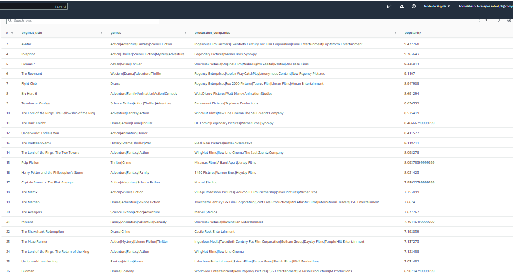
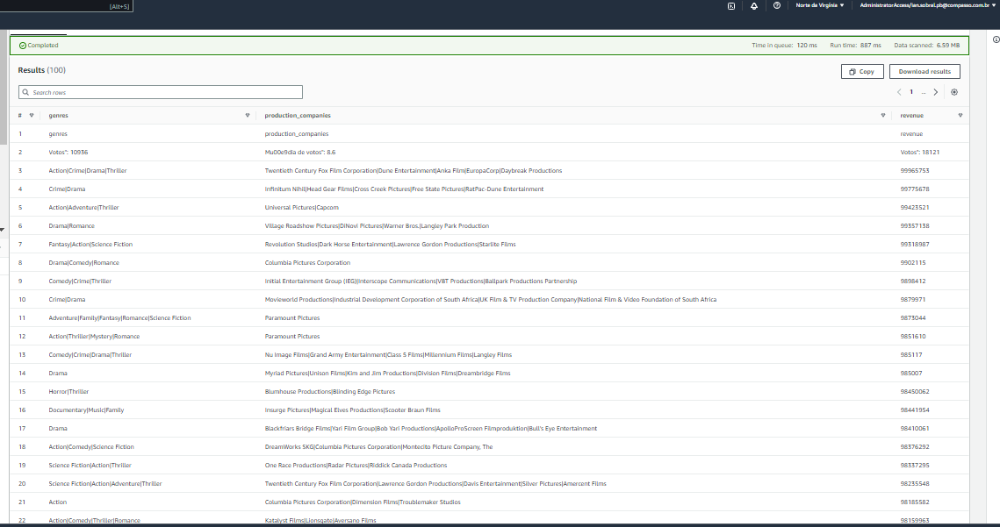

Antes de criar meu Dashboard, preciso ter bem definido o meu objetivo com a análise, juntamente com o Storytelling que será criado partindo dos dados analisados.

Isso foi definido na __[Sprint 8](https://github.com/ianpt0/programa-de-bolsas-compass/tree/master/sprint-08)__ mas farei algumas adições e alterações para enriquecer nossa análise, segue ela:

**Tema:** Produtoras

**Objetivo:** Investigar as produtoras para descobrir quais possuem maior variedade de gênero em suas produções e o orçamento que é disponibilizado para cada um deles.

ps: primeiro devo investigar a variedade dos gêneros de filmes por produtora para que a análise posterior do orçamento faça sentido.


# Revisão das tabelas para visualização dos dados com o QuickSight

Já tenho a tabela que foi construída na __[Sprint 9](https://github.com/ianpt0/programa-de-bolsas-compass/tree/master/sprint-09/assignment-4-modelagem-dados-refined)__ mas vou criar uma nova com novas Views que serão fundamentais para construção do Dashboard com o ojetivo desfinido.

## Tabela do Refined da Sprint 9

| Colunas       | Significado   |
| ------------- |:-------------:|
| col0          | Index         |
| col1          | Titulo        |
| col2          | Lançamento    |
| col3          | Visão geral   |
| col4          | Votos         |
| col5          | Média de votos|
| col6          | Produtora     |
| col7          | País          |
| col8          | Idioma        |
| col9          | Gênero        |

## Criação nova tabela no Athena

Criei no Athena a tabela que será usada para fazer todas as views na minha futura visualização dos dados no Quicksight.

```sql
CREATE EXTERNAL TABLE tmdb_ultimo_ultimo_ultimo (
  id STRING,
  imdb_id STRING,
  popularity STRING,
  budget STRING,
  revenue STRING,
  original_title STRING,
  actors STRING,
  homepage STRING,
  director STRING,
  tagline STRING,
  keywords STRING,
  overview STRING,
  runtime STRING,
  genres STRING,
  production_companies STRING,
  release_date STRING,
  vote_count STRING,
  vote_average STRING,
  release_year STRING,
  budget_adj STRING,
  revenue_adj STRING
)
ROW FORMAT SERDE 'org.apache.hadoop.hive.serde2.OpenCSVSerde'
WITH SERDEPROPERTIES (
  'separatorChar' = ',',
  'quoteChar' = '"',
  'escapeChar' = '\\',
  'serialization.null.format' = ''
)
LOCATION 's3://bucket-final-compass/';
```


# View 1 "filmes_por_produtora" | Top 15 produtoras com maior quantidade de filmes produzidos:

```sql
SELECT
    production_companies,
    COUNT(*) AS movie_count
FROM
    "tmdb-database"."tmdb_ultimo_ultimo_ultimo"
WHERE
    production_companies IS NOT NULL AND production_companies <> ''
GROUP BY
    production_companies
ORDER BY
    movie_count DESC
LIMIT 15;
```

Ok! Agora consigo visualizar quais as top 15 produtoras com maior quantidade de filmes produzidos e sua respectiva quantidade.



# View 2 "populares_genero_produtora" | Top 100 filmes mais populares, seus gêneros e produtora

```sql
SELECT
    original_title,
    genres,
    production_companies,
    popularity
FROM
    "tmdb-database"."tmdb_ultimo_ultimo_ultimo"
WHERE
    original_title IS NOT NULL
    AND genres IS NOT NULL
    AND production_companies IS NOT NULL
ORDER BY
    popularity DESC
LIMIT 50;
```

Agora consigo visualizar quais as top 10 produtoras com maior quantidade de filmes desses gêneros e a quantidade deles.



# View 3 "lucro_por_genero" | Os gêneros que as produtoras mais lucram

```sql
SELECT
    genres,
    production_companies,
    revenue
FROM
    "tmdb-database"."tmdb_ultimo_ultimo_ultimo"
WHERE
    original_title IS NOT NULL
    AND genres IS NOT NULL
    AND production_companies IS NOT NULL
ORDER BY
    revenue DESC
LIMIT 100;
```

Agora consigo visualizar os gêneros mais lucrativos por produtora.




Feito! Agora é só visualizar no Athena os gráficos gerados __[nesse link](https://us-east-1.quicksight.aws.amazon.com/sn/accounts/229890574488/dashboards/45a31b6f-1045-40dd-bc5a-42271687e570?directory_alias=ian-sobral)

Com isso conseguimos concluir com embasamento em dados que a Paramount é a produtora com filmes mais populares, entretando a Columbia Pictures é a produtora que investe de forma proporcional em maior variedade de gêneros.